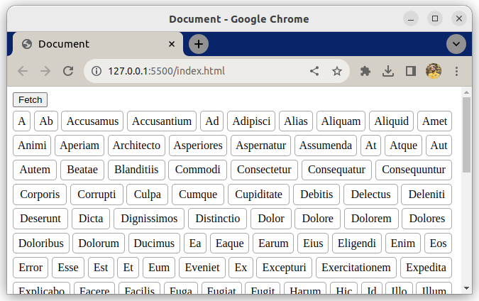

# Fetch and sort data

This exercise is about practicing `fetch` and Promises.

## Task

Your task is to load a list of data, sort it and display it on the page.

### Example

## Requirements

- Work in `main.js`, don't edit the other files
- Create a new function called `processData`
- When a user clicks the button, run processData

- In `processData`
    - Fetch the contents of `data.txt`
    - Turn the text data into an array, where each line is one array item
    - Sort the array alphabetically

- Add each *unique* entry once on the page as an `li`
    - See screenshot above for reference
