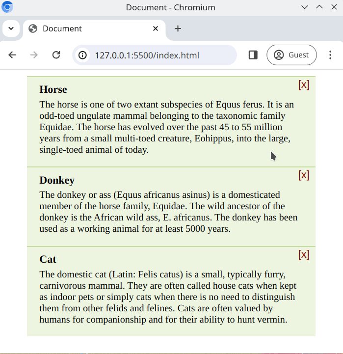

# Klicken zum Entfernen

Wir können das Benutzererlebnis der Benutzeroberfläche verbessern, indem wir Klickereignisse überwachen und das DOM dynamisch ändern. Versuchen wir das hier anzuwenden!

## Aufgabe

Die vorbereitete Webseite enthält eine Liste von Karten. In der oberen rechten Ecke jeder Karte befindet sich ein Schließen-Button "[X]". Wenn dieser Button geklickt wird, sollte die entsprechende Karte aus dem DOM entfernt werden.

- Das [HTML](./index.html) und [CSS](./style.css) wurden bereits für dich vorbereitet
- Du kannst den VS Code Live Server verwenden, um die Benutzeroberfläche anzusehen

## Anforderungen

- Schreibe deine Lösung in [script.js](./script.js)
- Bearbeite nicht das **HTML** oder **CSS**
- Beim `click`-Ereignis sollte das übergeordnete `div` aus dem DOM entfernt werden
- Du solltest nur **einen** Ereignis-Listener für das Klickereignis registrieren
- Verwende Ereignisdelegation

## Erwartetes Ergebnis

