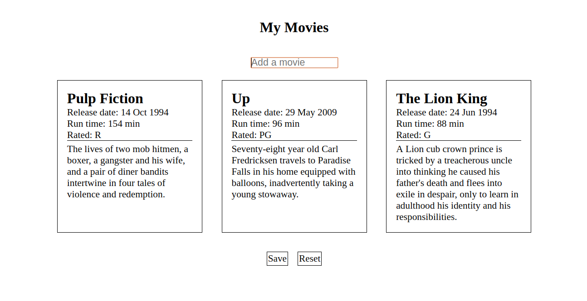

# Filmliste

Erstelle eine Filmliste, indem du Filme auf der Seite einfügst.

**Anleitung**:

-  Importiere und exportiere die Klassen nach Bedarf.
-  Arbeite mit der Datei `index.js`.
-  Löse das promise aus der Datei `Client.js` auf. Sobald es aufgelöst ist, zeige die Daten auf der Seite an. Hinweis: Du musst keinen Code in der Datei `View.js` oder `Client.js` ändern. Du musst nur ein Token aus der API in die Datei `Client.js` einfügen.
-  Ein Film sollte nur einmal angezeigt werden. Wenn ein Nutzer einen Film zweimal eingibt, wird eine Warnung angezeigt.
-  Der Nutzer sollte die Möglichkeit haben, seine Filmliste zu speichern, damit sie auch nach dem Aktualisieren der Seite noch angezeigt wird.
-  Der Nutzer sollte die Möglichkeit haben, die Seite zurückzusetzen - das bedeutet, dass die Filmliste komplett von der Seite entfernt wird und nichts mehr angezeigt wird, wenn die Seite neu geladen wird.

**Hinweise**

-  Wichtig: Verwende für diese Übung die folgende API: https://www.omdbapi.com/

**Bilder**

-  Leere Filmliste
   
-  Desktop-Filmliste
   
-  Mobile Filmliste
   
