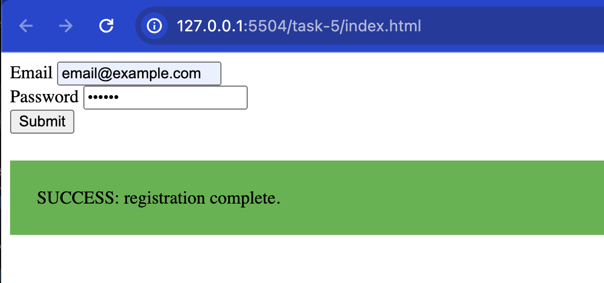
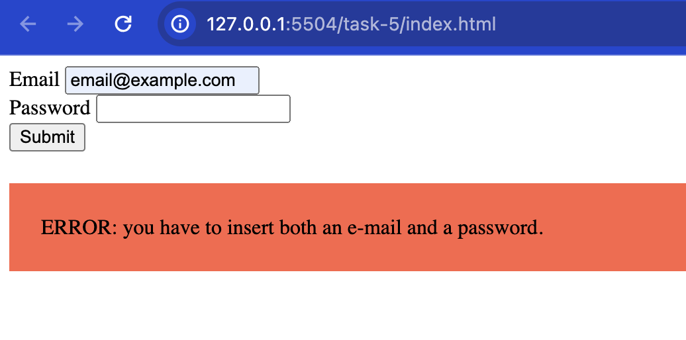

# Task 05

The page contains a `form` to simulate a registration process and a `div` with the class `message` to display a message to the user.

Your task is to display a success or error message, depending on the form being filled out correctly or not.

When the user submits the form:

- check the e-mail and the password fields
- if even one of the two fields is empty:
	- add the class `error` to the `div`
	- change the text inside the `div` to: `ERROR: you have to insert both an e-mail and a password.`
- otherwise, if they both contain a value:
	- add the class `success` to the `div`
	- change the text inside the `div` to: `SUCCESS: registration complete.`

**NOTES**:

- Make sure that the `div` never contains both the classes `success` and `error` at the same time.
- You don't have to check if they type a valid e-mail, it's enough to check that the field is not empty

## Preview

### Success 

### Error

